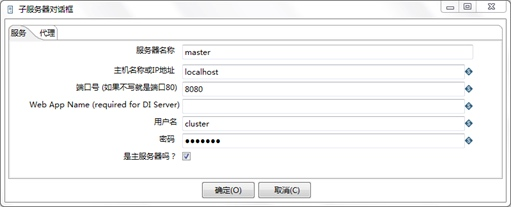
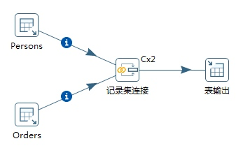
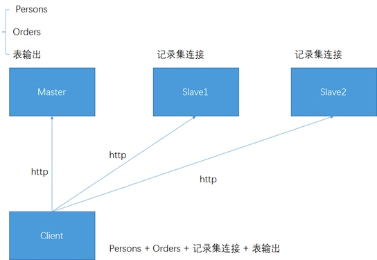

在 Kettle 中集群是由节点组成的，这些节点可以在不同的服务器上，也可以在同一台服务器上。

<!--more-->

## 子服务器

每个节点都有自己的节点名、主机名、端口、用户名和密码等属性。我们可以在 Spoon 界面下新建子服务器并设置相关的属性。

## 集群

在 Kettle 中集群分为动态集群和静态集群，两种集群都需要先定义一个 Master 节点，但是动态集群可以随时添加节点到集群，而静态集群需要事先定义好 Master 节点和若干个 Slave 节点。

* Master 节点

在一个 Kettle 集群中只有一个 Master 节点，该节点的作用在于追踪 Slave 节点的运行状态。当然 Master 节点的作用不仅限于此，它还可以运行Client 分配给自己的任务。

* Slave节点
一个集群中会包含若干个 Slave 节点，Slave 节点的主要功能是执行 Client 分配给自己的任务，除此之外还向 Master 汇报自己的运行状态。

## 任务分发

集群是由一个 Master 节点和若干个 Slave 节点组成的，其中 Master 节点用来处理 Transformatoin 中没有指明使用集群的 Step，而 Slave 节点用来处理被指明用集群运行的 Step。假设我们定义好了一个使用集群运行的转换，客户端首先会对转换中的步骤进行切分，不同的步骤被分配到不同的服务器上。那客户端是如何分配任务的了？在启动 Carte 是我们会指定主机名和端口号，这时 Carte 会启动一个 Web 服务，接收客户端的请求，假设我们需要运行的转换如下图所示：

上面的记录集连接有一个“Cx2”的上标，表明该 Step 是在集群上运行的，该转换对应的任务分发结构如下图所示：

在 Kettle 中任务的分发采用的是 Http 协议，当任务分发结束之后各节点就要开始执行任务了。节点之间的通信采用的是 TCP 协议，使用 Socket 来实现的，各节点的通信流程如下图：

## 节点通信

与单机模式不同，不同的节点之间是需要相互通信的，Kettle 通过前后的 Step 是否在一个节点上来添加 RemoteStep，通过 RemoteStep 可以实现不同节点信息的交换，每个 Step 可以有负责写数据的 RemoteStep 和负责读数据的 RemoteStep，这些 RemoteStep 都是在子线程中负责循环读写数据，整体的结构和单机版的保持一致，只是在数据传输方面使用了 Socket。

