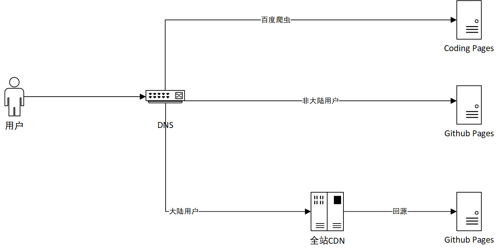

## 概要

本站点基于 GitHub Pages 以及 Hexo 搭建而成，因为 GitHub Pages 在国内访问速度并不理想，而且由于百度的爬虫被 GitHub 屏蔽掉了，所以 GitHub Pages 的体验在国内并不好，但站在全球的角度来看还是很稳定的。为了解决这些问题，本站点采用双线部署，Coding Pages 的服务主要提供给百度爬虫使用，非大陆的请求直接访问 GitHub Pages 国外的服务器，大陆用户借助阿里云的全站加速做 CDN，有效的解决了上述这些问题。

## 工作

湖北籍魔都 Java 程序员，做过 Android，涉猎过大数据，专注于 Java 生态圈的各项技术。目前就职于“XXX 酒店”中间件团队，主要负责服务治理，链路压测相关的研发工作。

## 兴趣

### PS4

* 最喜爱的游戏：极品飞车：复仇、神秘海域、煮糊了2
* 已通关的游戏：GTA5、神秘海域1、艾希
* 正在肝的游戏：怪物猎人、战地1

### 王者荣耀

* 大区：苹果微信50区
* 昵称：AG超会玩码农
* 战绩：S16 最强王者

### 搞机

* 电脑：Macbook Pro 2016 15 Inch
* 显示器：DELL U2515H
* 路由器：ASUS AC86U
* 常用VPS：搬瓦工洛杉矶 GIA

---

如果你对本站的内容有任何意见或者看法，欢迎在下方留言，本人会在第一时间内回复大家。

